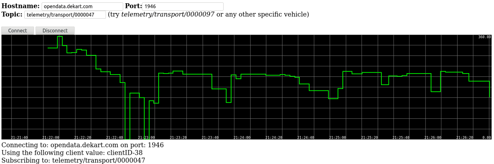

Acest exemplu demonstrează cum să primești în timp real datele telemetrice
și să vizualizezi o parte din ele. În cazul dat, vom afișa dinamica parametrului
`direction`

1. Deschide fișierul `index.html` în browser
2. Abonează-te la telemtria unui tracker anumit. Lista acestora e [disponibilă aici](https://github.com/roataway/infrastructure-data/blob/master/vehicles.csv). Spre exemplu, dacă vrei să monitorizezi trackerul `0000097`, atunci parametrul `topic` trebuie setat la `transport/telemetry/0000097`
3. Apasă `Connect` și așteaptă să vină datele, ar trebui să vezi așa ceva:

Dacă datele nu se afișează, posibil troleibuzul e offline sau trackerul acestuia a fost deconectat; încearcă un alt tracker.

Referințe:
- Vezi `demo.js` pentru detalii
- http://smoothiecharts.org/tutorial.html
- https://www.thomaslaurenson.com/blog/2018/07/10/mqtt-web-application-using-javascript-and-websockets/
- https://www.eclipse.org/paho/clients/js/